# 💰 Personal Finance Companion 


A comprehensive personal finance companion app built for Android that helps users track expenses, manage savings goals, and gain valuable spending insights.

## 📱 Assignment Context

This project was developed as part of a **Mobile App Development Assignment** with the following objective:

> *"To evaluate mobile app development skills through a practical assignment focused on app structure, user experience, state handling, and thoughtful feature design."*

The goal was to demonstrate product thinking, mobile UI/UX quality, creativity, and clean code architecture.

## 🎯 Core Requirements Met

### 1. Home Dashboard ✅
- Current balance display with color coding (green for positive, red for negative)
- Total income and expenses for current month
- Savings rate calculation and progress indicator
- Interactive pie chart showing spending by category
- Recent transactions list (last 5 entries)
- Quick-add FAB button for new transactions

### 2. Transaction Tracking ✅
Complete CRUD operations with:
- **Add**: Amount, type (Income/Expense), category, date, description
- **View**: Chronological list of all transactions
- **Edit**: Tap any transaction to modify
- **Delete**: Long press with confirmation dialog
- **Search**: Search by description or category
- **Filter**: Filter by transaction type and category

### 3. Goal/Challenge Feature ✅ - Streak-Based Saving System
Creative implementation featuring:
- **Savings Goals**: Create multiple savings goals with target amounts
- **Streak Tracking**: Consecutive days adding to goals (🔥 emoji visual)
- **Progress Visualization**: Progress bars with percentage
- **Deadline Tracking**: Time-bound goals with due dates
- **Goal Completion**: Auto-detection and celebration of achieved goals

### 4. Insights Screen ✅
Comprehensive analytics including:
- **Top Spending Category**: Highest expense category with amount
- **Week-over-Week Comparison**: This week vs last week with percentage change
- **Monthly Trend**: Bar chart showing last 4 weeks of spending
- **Category Breakdown**: Pie chart of all expense categories
- **Summary Statistics**: Monthly total and all-time total expenses

### 5. Smooth Mobile UX ✅
- Material Design 3 components
- Bottom navigation and FAB for primary actions
- Empty states with friendly messages
- Loading states and error handling
- Swipe to delete with undo option
- Form validation and input handling
- Touch-friendly targets (minimum 48dp)

### 6. Local Data Handling ✅
- **Pure SQLite** database (no Room ORM)
- SQLiteOpenHelper implementation
- Complete CRUD operations
- Data persists across app restarts
- No internet connection required (offline-first)

### 7. Code Structure & State Management ✅
- **MVVM Architecture** pattern
- Repository pattern for data abstraction
- SQLiteOpenHelper for database management
- Clear separation of concerns:
  - `models/` - Data entities
  - `data/` - Database operations
  - `ui/` - Activities and UI logic
  - `adapters/` - RecyclerView adapters
  - `utils/` - Helper classes

## 🛠️ Technical Stack

| Component | Technology | Reason |
|-----------|------------|--------|
| **Language** | Java | Native Android development |
| **Minimum SDK** | API 24 (Android 7.0) | 95%+ device coverage |
| **Target SDK** | API 34 (Android 14) | Latest Android features |
| **Database** | SQLite (Pure) | Full control, no ORM overhead |
| **Charts** | MPAndroidChart | Professional visualizations |
| **UI** | Material Design 3 | Modern, consistent design |
| **Architecture** | MVVM | Clean separation of concerns |

## 📂 Project Structure
PersonalFinance/
├── app/
│ ├── src/main/java/com/personalfinance/
│ │ ├── MainActivity.java # Dashboard screen
│ │ ├── adapters/
│ │ │ ├── TransactionAdapter.java # Transaction list adapter
│ │ │ └── GoalAdapter.java # Goals list adapter
│ │ ├── models/
│ │ │ ├── Transaction.java # Transaction entity
│ │ │ ├── SavingsGoal.java # Savings goal entity
│ │ │ └── Category.java # Category enum
│ │ ├── data/
│ │ │ └── DatabaseHelper.java # SQLite database helper
│ │ ├── ui/
│ │ │ ├── transactions/
│ │ │ │ ├── TransactionListActivity.java
│ │ │ │ └── AddEditTransactionActivity.java
│ │ │ ├── goals/
│ │ │ │ ├── GoalsActivity.java
│ │ │ │ └── AddEditGoalActivity.java
│ │ │ └── insights/
│ │ │ └── InsightsActivity.java
│ │ └── utils/
│ │ └── CurrencyFormatter.java # Currency formatting
│ └── src/main/res/ # Layouts, drawables, values
├── build.gradle # Project build file
├── settings.gradle
└── README.md

## 🗄️ Database Schema

### Transactions Table
```sql
CREATE TABLE transactions (
    id INTEGER PRIMARY KEY AUTOINCREMENT,
    amount REAL NOT NULL,
    type TEXT NOT NULL,           -- 'INCOME' or 'EXPENSE'
    category TEXT NOT NULL,
    description TEXT,
    date DATETIME NOT NULL
);

### 🗄️ Savings Goals Table
```sql
CREATE TABLE savings_goals (
    id INTEGER PRIMARY KEY AUTOINCREMENT,
    title TEXT NOT NULL,
    target_amount REAL NOT NULL,
    current_amount REAL DEFAULT 0,
    category TEXT,
    deadline TEXT,
    is_completed INTEGER DEFAULT 0,
    streak INTEGER DEFAULT 0 -- Consecutive saving days
);

### 📥 Installation & Setup
Prerequisites
Android Studio Hedgehog | 2023.1.1 or later

JDK 8 or higher

Android SDK API 24+

### Steps to Run
Clone the repository

bash
git clone https://github.com/SashirekhaRanganathan/PersonalFinance.git
Open in Android Studio

Launch Android Studio

Select "Open an Existing Project"

Navigate to the cloned folder

Build the project

Wait for Gradle sync to complete

Click Build → Make Project

Run the app

Connect an Android device (USB debugging enabled) or start an emulator

Click Run → Run 'app'

###📱 How to Use the App

First Launch
App starts with empty database (₹0.00 everywhere)

No sample data - you control everything

Adding Your First Transaction
Tap the + (Floating Action Button)

Select Income or Expense

Enter amount (e.g., 50000)

Choose category (Salary, Food, etc.)

Pick date (defaults to current)

Add description (optional)

Tap Save

### Managing Transactions
View All: Transactions tab shows all entries

Search: Use search bar to find by description/category

Filter: Tap filter icon to filter by type/category

Edit: Tap any transaction to modify

Delete: Long press and confirm deletion

### Creating Savings Goals
Navigate to Goals section

Tap + button

Enter goal title (e.g., "New Laptop")

Set target amount

Choose category

Set deadline (optional)

Tap Save Goal

### Adding Progress to Goals
Tap on any goal card

Enter amount to add

Streak counter increases automatically

Progress bar updates in real-time

### Viewing Insights
Navigate to Insights section

View top spending category

Check week-over-week comparison

Analyze monthly trends

See category breakdown

### ✨ Features Summary
Completed Features
✅ Home Dashboard with charts

✅ Complete transaction CRUD

✅ Search and filter functionality

✅ Savings goals with streak system

✅ Insights 

✅ SQLite local storage

✅ Material Design UI

✅ Empty and loading states

✅ Form validation

✅ Error handling

## 📸 Screenshots

### 🏠 Dashboard Journey

| | Screenshot | Description |
|---|------------|-------------|
| 1 | 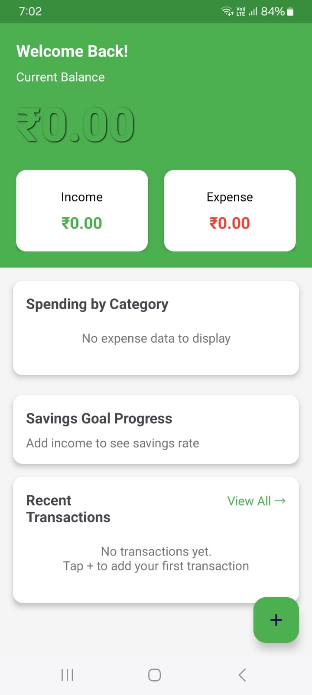 | Empty dashboard - no data |
| 2 |  | After adding ₹50,000 salary |
| 4 | 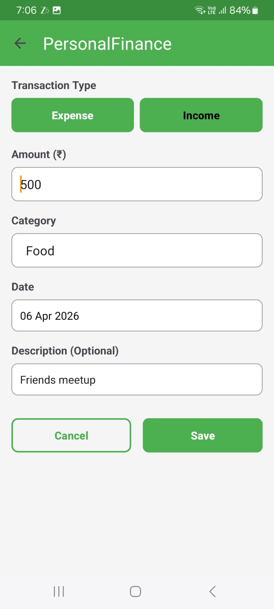 | After adding ₹500 expense |
| 16 | 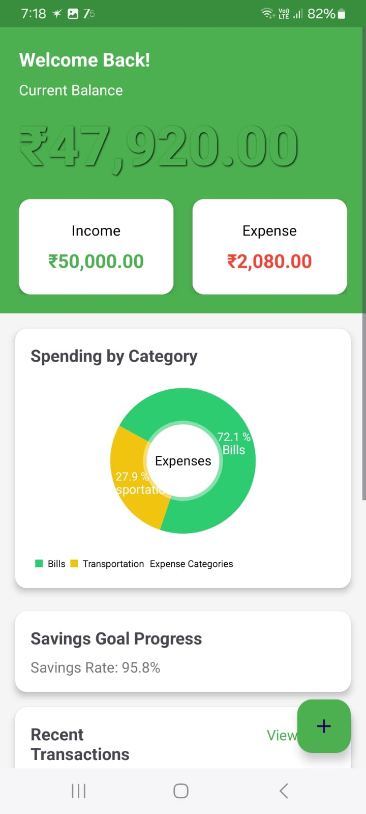 | Complete dashboard with chart |

---

### 📋 Transactions

| | Screenshot | Description |
|---|------------|-------------|
| 9 | 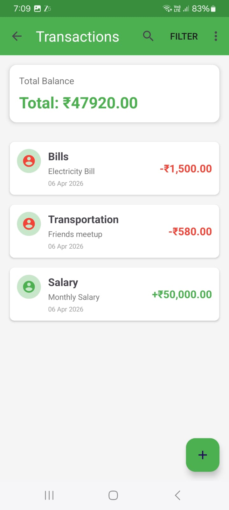 | All transactions list |
| 11 | 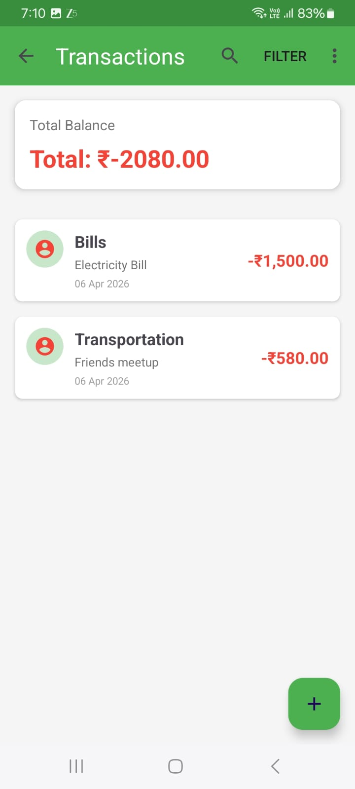 | With balance summary |
| 6 | 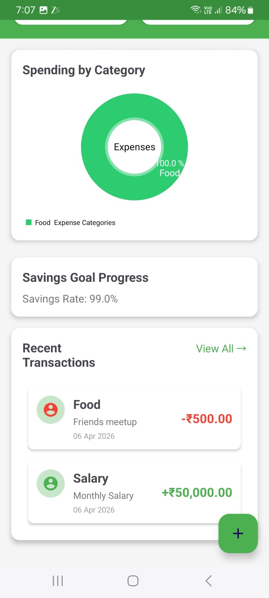 | Complete history |
| 10 | 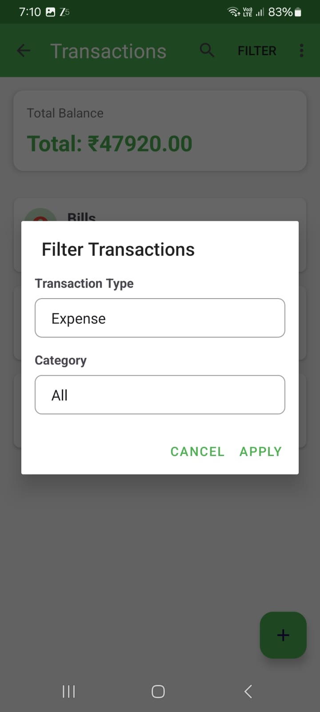 | Filter dialog |
| 7 | 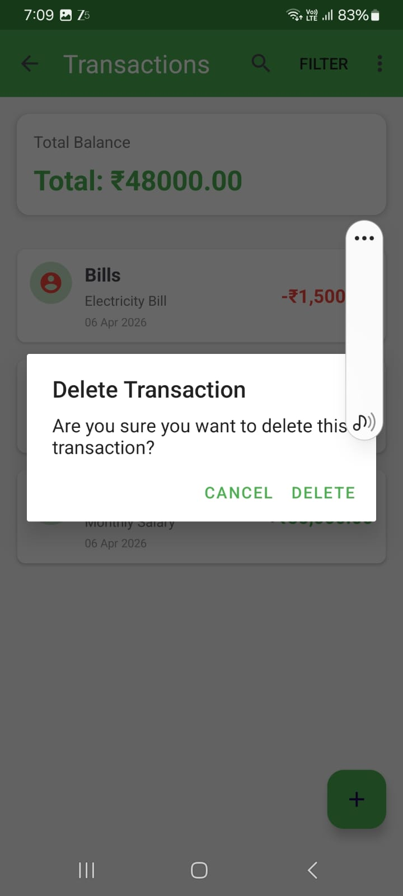 | Delete confirmation |

---

### ✏️ Add & Edit

| | Screenshot | Description |
|---|------------|-------------|
| 3 | 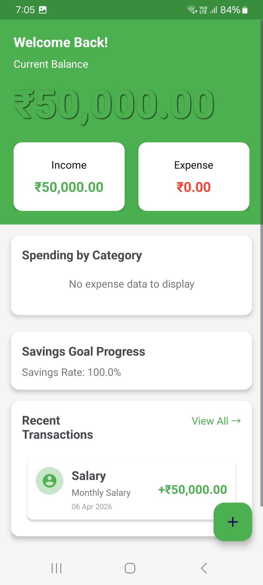 | Add transaction form |
| 8 | 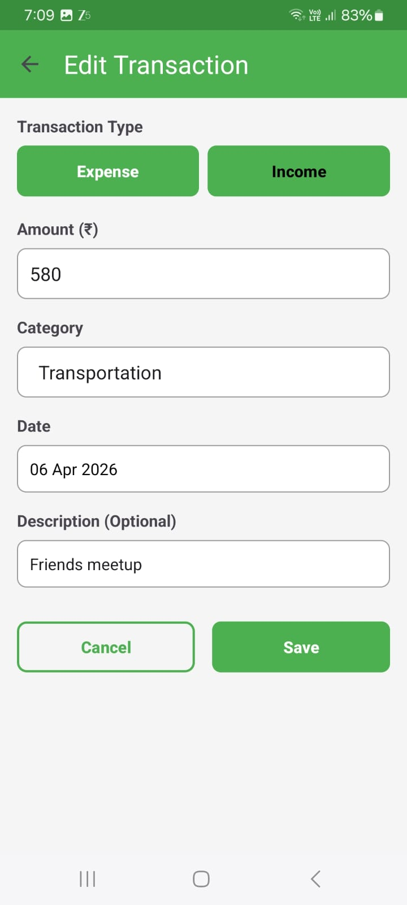 | Edit transaction |

---

### 🎯 Goals

| | Screenshot | Description |
|---|------------|-------------|
| 12 | 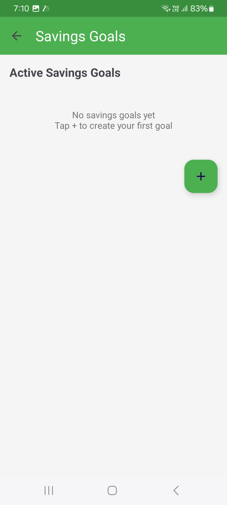 | No goals yet |
| 14 | 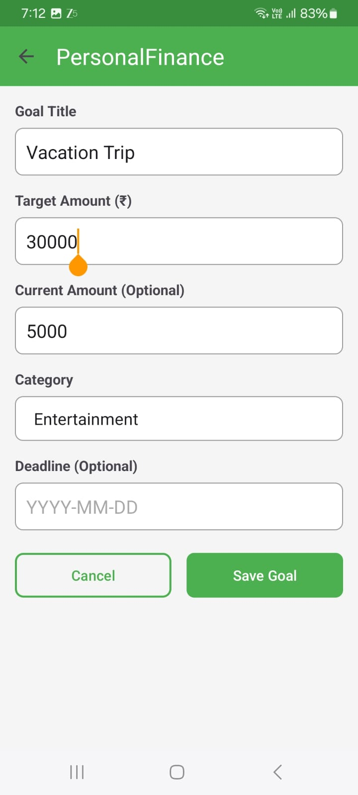 | Create new goal |
| 13 | 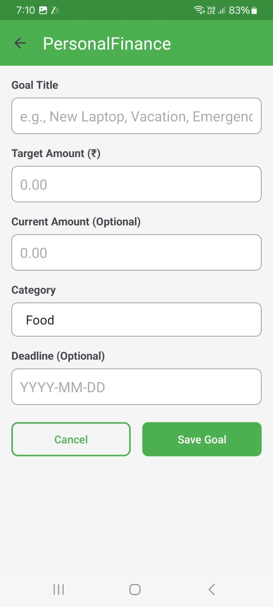 | Goal with data |
| 15 | 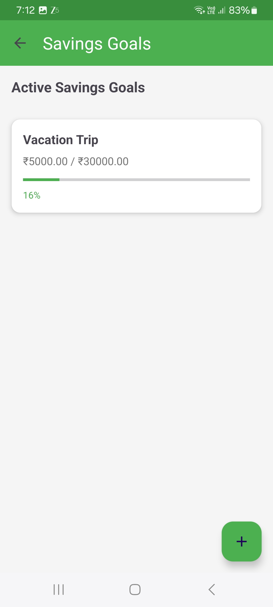 | Goals with progress & streaks 🔥 |

---

### 📊 Insights

| | Screenshot | Description |
|---|------------|-------------|
| 5 | 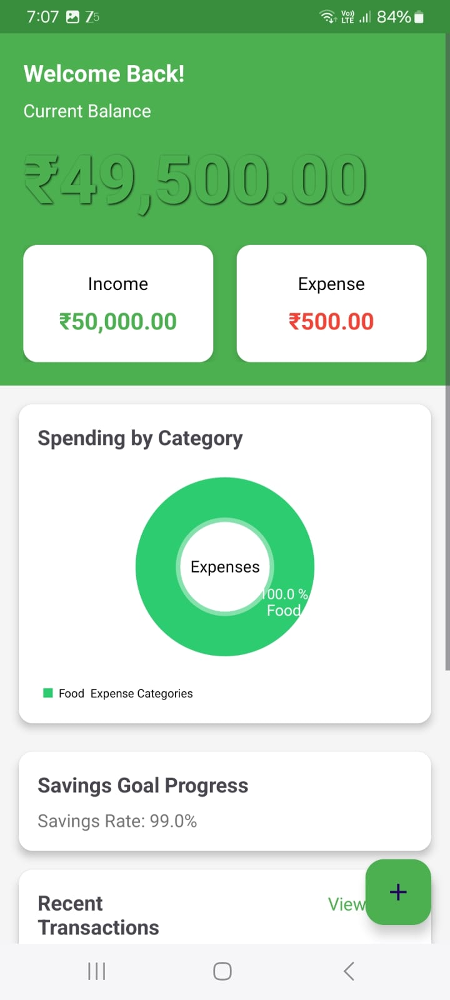 | Spending analysis & trends |
## 🎬 App Flow


📝 Assignment Notes
This app was developed to demonstrate:

Thoughtful Design - Every screen serves a clear purpose

User Experience - Intuitive navigation, clear feedback

Code Quality - Maintainable, well-structured code

Creativity - Unique streak-based goal system

Technical Competence - SQLite, MVVM, Material Design

👩‍💻 Developer
Name: Sashirekha Ranganathan

Assignment: Personal Finance Companion Mobile App

Date: April 2026

📄 License
This project is for educational purposes as part of a mobile development assignment.

🙏 Acknowledgments
MPAndroidChart library for beautiful charts

Material Design guidelines for UI inspiration

Android documentation for best practices

📞 Contact
For any questions regarding this submission, please open an issue on GitHub.
